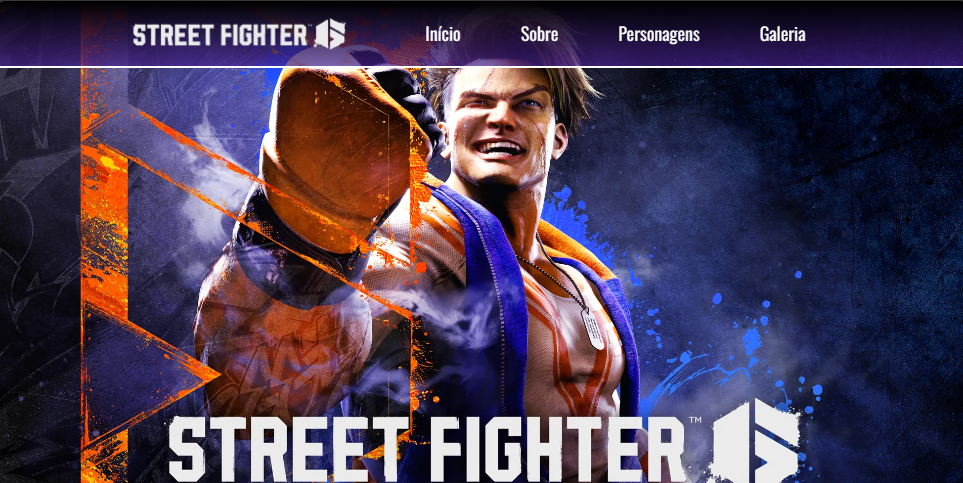

# 🕹 Street Fighter Project


Um projeto responsivo do jogo Street Fighter.

## 🚀 Descrição do Projeto

Bem-vindo ao incrível projeto Street Fighter! Este é um jogo responsivo desenvolvido com HTML, CSS, e JavaScript. Aprecie a nostalgia dos clássicos duelos de luta!

## 🛠️ Recursos Utilizados

- [](https://developer.mozilla.org/en-US/docs/Web/HTML) [](https://developer.mozilla.org/en-US/docs/Web/CSS) [](https://developer.mozilla.org/en-US/docs/Web/JavaScript)

- [](https://getbootstrap.com/) [](https://jquery.com/) [](https://jqueryui.com/) [](https://developer.mozilla.org/en-US/docs/Web/CSS/Media_Queries)

## 📷 Preview do Projeto



## 🛠 Instalação

1. Clone o repositório:

    ```bash
    git clone https://github.com/seu-usuario/seu-repositorio.git
    ```

## 🎉 Agradecimentos

Um agradecimento especial a todos os contribuidores deste projeto. Vocês são incríveis! 👏
